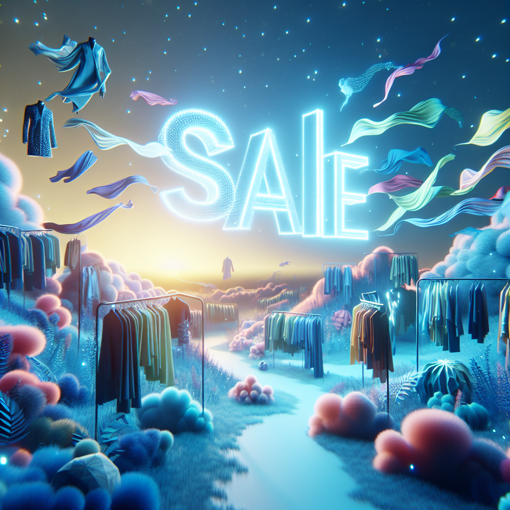
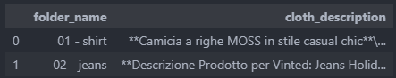

# Automatic inventory of your clothes for sale

Manually describing each item to sell it online (say, on vinted.it) can take you a long time.

This package helps you by feeding the images to an LLM and generating the description from the images.

--------
Usage:
- create the file .env in the main directory
Version 1.0 uses OpenAI GPT-4o for image recognition.
To run you will have to enter your key into a file .env

open the file with a text editor and add an entry 
OPENAI_API_KEY="sk-...."

- create a folder named "data"

within the data folder create subfolders with appropriate names

ex. 
'1 - armani jeans'
'2 - versace shirt'

and copy the photo of each item in the respective subfolder.

Finally run the main script

python main.py

OUTPUT: dataframe with description for each item

Example output:

--------